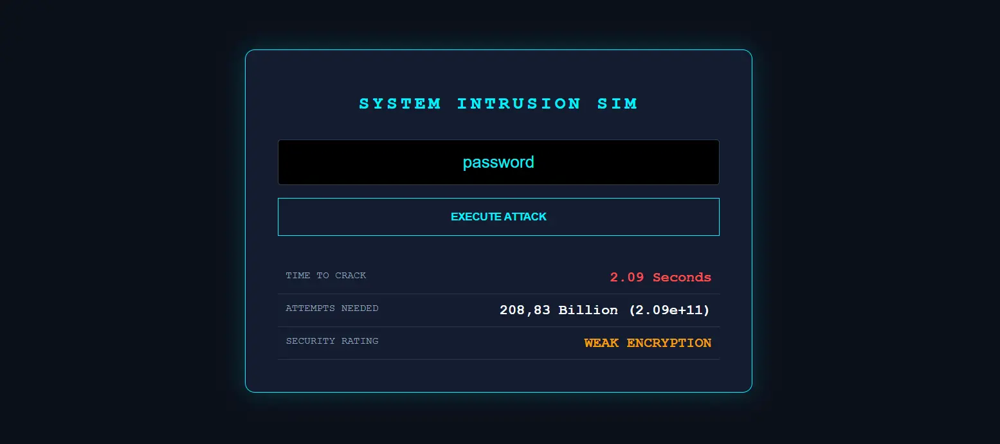

# CyberGuard

A visually designed password security simulator that demonstrates password strength in an entertaining and easy-to-understand way.

[Live Demo](https://nicohartmann.dev/cyberguard.html) 



## What is CyberGuard?

CyberGuard is a browser-based password security simulator. Users enter any password and receive an animated "hacking" simulation with terminal-like effects, random log outputs, and a dynamic decryption animation.

In the background, the tool calculates a theoretical number of possible combinations based on character diversity (lowercase/uppercase letters, numbers, and special characters) as well as password length. From this, it estimates how long an extremely powerful attacker would need to crack the password using brute-force attempts.

At the end, the user receives a security rating, ranging from **"Critical Vulnerability"** to **"Secure"**, based on the calculated entropy of the password.

> ⚠️ This is purely for demonstration and awareness purposes. CyberGuard is not intended for real security testing.

## Features

- **Password Input**: Enter any password to trigger the hacking simulation.
- **Animated Terminal**: Watch a realistic-looking brute-force attack unfold with live log outputs and decryption effects.
- **Entropy Calculation**: Analyzes character diversity (lowercase, uppercase, numbers, special characters) and password length to compute the theoretical combination space.
- **Crack Time Estimation**: Estimates how long a highly powerful attacker would need to crack the password via brute force.
- **Security Rating**: Receives a final verdict ranging from *"Critical Vulnerability"* to *"Secure"*.

## Tech Stack

- **HTML5**: For the page structure and layout UI.
- **CSS3**: For styling, terminal aesthetics, and animations.
- **JavaScript**: For entropy calculation, crack time estimation, and simulation logic.

## Getting Started

To run this project locally, follow these simple steps:

**1. Clone the Repository**

```bash
git clone https://github.com/kt-NicoHartmann/CyberGuard.git
```

**2. Open the Project**

Navigate into the project directory and open the HTML file in your preferred web browser.

```bash
cd CyberGuard/crack_pw_sim_en/
# On macOS/Linux:
open crack_pw_sim_en.html
# On Windows:
start crack_pw_sim_en.html
```

Alternatively, use the **Live Server** extension in VS Code to host it locally.
